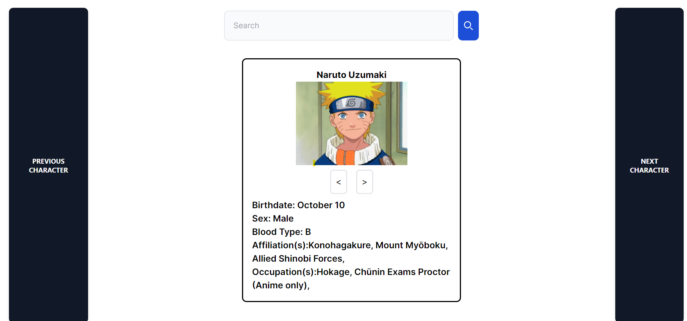

# What is this?

I thought this would be a neat little project. This leverages an awesome api [NarutoDB](https://github.com/hellskater/narutodb-website) from one of my favorite anime.

My App lets you search or flip through different characters from the manga/anime and see some info about them.


## Getting Started

First, run the development server:

```bash
npm run dev
# or
yarn dev
# or
pnpm dev
# or
bun dev
```

Open [http://localhost:3000](http://localhost:3000) with your browser to see the result.
